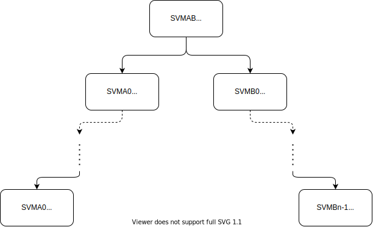
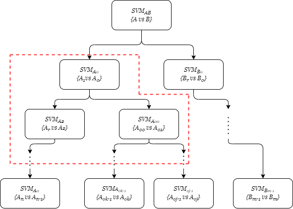

# SVM_THESIS_PROJECT

SVM_THESIS_PROJECT is a Python library and tests of hyperspectral images utilizing Support Vector Machine with Binary Decision Tree. 
The project is a part of project thesis in the Fall 2022 with cooperation of the HYPSO team at NTNU in Norway. 


## Usage 



(**Figure**) : How the implementation of the SVMBDT tree strucutre with the classes `A` and `B`. 


This shows how the functions: `SvmDesionTreeTrain()` and `SvmDesionTreePredict()` are used for training and predicting in Python, where `X_train` and `y_train` are training data and labels from hyperspectral dataset. Where  `X` is a test data of a hyperspectral image.

The SVM Models in the `svm_tree_branch` is SVC() function from the library [Sklearn](https://scikit-learn.org/stable/modules/generated/sklearn.svm.SVC.html). 

```python

from SVMBDT import SvmDesionTreeTrain, SvmDesionTreePredict

# N is the number of layers in the tree_branch. 
# A = A_0, ..., A_n are classes with n size. 
# B = B_0 ..., B_1 are classes with m size. 

tree_branch = {0 : [[A_0,...,A_n],[B_0,...,B_n]],
               1 : [[[A_0],[A_1,...,A_n]],[[B_0],[B_1,...,B_m]]],
                ... , 
                N : {[[[A_(n-1)],[A_n]],[[B_(m-1)],[B_m]]]}

svm_tree_branch = {0 : SVC(), 
                   1 : [SVC(), SVC()],
                    ..., N : [SVC(),SVC()]}

svm_tree_branches = SvmDesionTreeTrain(X_train, y_train, tree_branch, svm_tree_branch)

predicted_label = SvmDesionTreePredict(X, svm_tree_branches, tree_branch)

```

```python

#If the n < m the tree_branch and svm_tree_branch should be for example: 

tree_branch = {0 : [[A_0,...,A_n],[B_0,...,B_n]],
               1 : [[[A_0],[A_1,...,A_n]],[[B_0],[B_1,...,B_m]]],
                ... , 
                N : {[],[[B_(m-1)],[B_m]]]}

svm_tree_branch = {0 : SVC(), 
                   1 : [SVC(), SVC()],
                    ..., N : [False,SVC()]}

```

### Multi branch 



(**Figure**) : How the implementation of Multi Branch strucutre is implemented. 

Code below shows how the tree structure can have multiple branches in sub-branch. The functions are used are `RetrieveSubData()` and `CombineMultiBranch` that is for training the sub-tree and combining the predicted labels from the sub-tree to the main tree. 

```python

#Training of the main tree

svm_tree_branches1, sub_data_branch1 = SvmDesionTreeTrain(X_train, y_train, tb1, sbm1, sub_data = 1)

# Retriveing sub-data and training of the sub-tree. 

sub_data2, sub_labels2 = RetrieveSubData(X_train,y_train, tb2[0])

svm_tree_branches2, sub_data_branch2 = SvmDesionTreeTrain(sub_data2, sub_labels2, tb2, sbm2, sub_data=1)

# Predicting the main tree and the sub-tree.

pl1, sd1, pbl1 = SvmDesionTreePredict(X, svm_tree_branches1, tb1, sub_data=1)
sub_data_2 = sd1[1][1][pbl1[1][1] == min(tb1[1][1][0])]
pl2, sd2, pbl2 = SvmDesionTreePredict(sub_data_2, svm_tree_branches2, tb2, sub_data=1)

#Combining the sub-tree prediction into the main tree. 

cmb2 = CombineMultiBranch(pl2, tb2, pbl1[1][1])
pbl1[1][1] = cmb2
predicted_label = CombineLabels(pbl1, tb1)

```


# Numerical Experiments

The test of 4 different datasets: Samson, Jasper Ridge, Mjøsa and Trondheim are found uner the folder Model/. The test are executed on Jupyter Notebooks with the names: 
- Samson_Model.ipynb
- Jasper_Model.ipynb
- Mjosa_Model.ipynb
- Trondheim_Model.ipynb